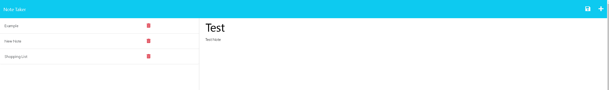

# Note Taker

## Description

This application allows users to make notes via entries and save them so they persist upon page reload.

Preview Image:

## Table of Contents

- [Usage](#usage)
- [License](#license)
- [Contributors](#contributors)
- [Questions](#questions)

## Usage

Enter note to be saved in the input field. You can save the note by clicking the corresponding icon. Notes can be removed/deleted by clicking the trash icon.

## License

MIT

## Contributors

Natasha Mann - helped implement and clean up code for post/delete routes.

## Questions

If you have any questions you can reach me at edrezner7@gmail.com. Visit my GitHub [edrezner](https://www.github.com/edrezner) to see more of my work.
